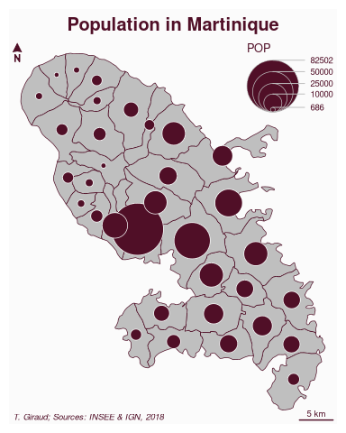

<!-- README.md is generated from README.Rmd. Please edit that file -->


# mapsf

<!-- badges: start -->

[](https://cran.r-project.org/package=mapsf)
[](https://github.com/riatelab/mapsf/actions/workflows/R-CMD-check.yaml)
[](https://cran.r-project.org/package=mapsf)
[](https://app.codecov.io/gh/riatelab/mapsf?branch=master)
[](https://CRAN.R-project.org/package=mapsf)
[](https://www.bestpractices.dev/projects/8704)
[](https://www.repostatus.org/#active)
<!-- badges: end -->

**Create thematic maps and integrate them into your R workflow.**  
This package helps you design different cartographic representations
such as proportional symbols, choropleths, or typology maps.  
It also provides several functions for displaying layout elements that
enhance the graphical presentation of maps (e.g., scale bar, north
arrow, title, labels).  
`mapsf` maps `sf` objects on `base` graphics.

## Installation

You can install the released version of `mapsf` from
[CRAN](https://cran.r-project.org/package=mapsf) with:

``` r
install.packages("mapsf")
```

Alternatively, you can install the development version of `mapsf` from
GitHub (**dev** branch) with:

``` r
remotes::install_github("riatelab/mapsf", ref = "dev")
```

## Usage

This is a basic example which shows how to create a map with `mapsf`.

``` r
library(mapsf)
# Import the sample dataset
mtq <- mf_get_mtq()
# Plot the base map
mf_map(x = mtq)
# Plot proportional symbols
mf_map(x = mtq, var = "POP", type = "prop", leg_pos = "topright")
# Plot a map layout
mf_layout(
  title = "Population in Martinique",
  credits = "T. Giraud; Sources: INSEE & IGN, 2018"
)
```

<!-- -->

You can find more detailed examples on the [“Get
Started”](https://riatelab.github.io/mapsf/#/vignettes/mapsf) section of
the [package website](https://riatelab.github.io/mapsf/) and you can
also download its [cheat
sheet](https://raw.githubusercontent.com/riatelab/mapsf/master/vignettes/fig/mapsf_cheatsheet.pdf).  
[](https://raw.githubusercontent.com/riatelab/mapsf/master/vignettes/fig/mapsf_cheatsheet.pdf)

## Alternatives

- [tmap](https://github.com/r-tmap/tmap)  
- [ggplot2](https://github.com/tidyverse/ggplot2) +
  [ggspatial](https://github.com/paleolimbot/ggspatial)

## Community Guidelines

One can contribute to the package through [pull
requests](https://github.com/riatelab/mapsf/pulls) and report issues or
ask questions [here](https://github.com/riatelab/mapsf/issues). See the
[CONTRIBUTING.md](https://github.com/riatelab/mapsf/blob/master/CONTRIBUTING.md)
file for detailed instructions on how to contribute.  
This project uses [conventional
commits](https://www.conventionalcommits.org/en/v1.0.0-beta.3/) and
[semantic versioning](https://semver.org/).
