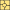
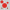
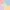
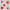
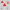
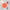
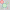
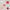
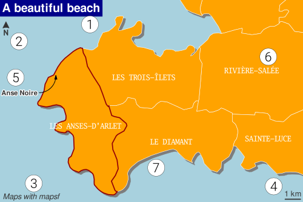

```{r, include = FALSE}
knitr::opts_chunk$set(
  collapse = TRUE,
  comment = "#>",
  fig.width = 5,
  fig.height = 6
)
```

# Introduction

The aim of `mapsf` is to obtain thematic maps with the visual quality of those build with a classical mapping or GIS software.  
`mapsf` uses [`sf`](https://CRAN.R-project.org/package=sf) objects to produce `base` graphics.  
`mapsf` functions can be classified in the following categories:

- **Symbology**\
`mf_map()` is the main function of the package, it displays map layers on a georeferenced plot. Many parameters are available to fine tune the cartographic representations. These parameters are the common ones found in GIS and automatic cartography tools (e.g. classification and color palettes used in choropleth maps, symbols sizes used in proportional symbols maps...).  

- **Map Layout**\
Along with the cartographic functions, some other functions are dedicated to layout design (e.g. legends, scale bar, north arrow, title, credits...).  

- **Utility Functions**\
    A set of functions is dedicated to the creation of spatial objects (e.g. links creation) or other utility tasks (e.g. color palette management, class intervals extraction, sample dataset import...).


# Main Features

## Symbology

`mf_map()` has three main arguments:

* `x` an sf object
* `var` the name(s) of a variable(s) to map
* `type` the map layer type

The following map types are available:

*  **base**: displays sf objects geometries  
*  **prop**: displays symbols with areas proportional to a quantitative variable (stocks)  
*  **choro**: areas are shaded according to the variation of a quantitative variable   
*  **typo**: displays a typology map of a qualitative variable    
*  **symb**: displays the different modalities of a qualitative variable as symbols  
*  **grad**: displays graduated symbols   
*  **prop_choro**: displays symbols with sizes proportional to values of a first variable and colored to reflect the classification of a second quantitative variable  
*  **prop_typo**: displays symbols with sizes proportional to values of a first variable and and colored to reflect the modalities of a second qualitative variable   
*  **symb_choro**: displays the different modalities of a first qualitative variable as symbols colored to reflect the classification of a second quantitative variable  


Additionaly, `mf_raster()` can be used to displays raster objects (single/multi band, continuous, classes, intervals). 


## Map Layout

These functions are dedicated to the map layout design.




|         |     |
|--------|----------------------|
| &#9312; `mf_title()`      | Title of the map   |
| &#9313; `mf_arrow()`      | North arrow        |
| &#9314; `mf_credits()`    | Author, sources... |
| &#9315; `mf_scale()`      | Scale bar          |
| &#9316; `mf_annotation()` | Annotations        |
| &#9317; `mf_label()`      | Labels             |
| &#9318; `mf_shadow()`     | Shadow             |


## Themes

`mf_theme()` sets a map theme. A theme is a set of graphical parameters that are applied to maps created with `mapsf`. These parameters are the figure margins, background and foreground colors and `mf_title()` options. `mapsf` offers some builtin themes. It’s possible to modify an existing theme or to start a theme from scratch. Themes are persistent across maps produced by mapsf (e.g. they survive a `dev.off()` call).

&#128279; See the online vignette: [How to use themes](https://riatelab.github.io/mapsf/#/vignettes/how_to_use_themes) 

## Export

`mf_svg()` and `mf_png()` export maps in SVG and PNG formats, respectively.
The exported map width/height ratio will match the one of a spatial object.   
**SVG export** is the perfect solution for editing maps with desktop vector graphics software, such as Inkscape. SVG is a [vector graphics](https://en.wikipedia.org/wiki/Vector_graphics) file format.      
**PNG export** should be used for maps that do not require further modification. PNG is a [raster graphics](https://en.wikipedia.org/wiki/Raster_graphics) file format.   


&#128279; See the online vignette: [How to export maps](https://riatelab.github.io/mapsf/#/vignettes/how_to_export_maps) 


# Examples of thematic maps

## Base map

`mf_map(x, type = "base")` displays `sf` objects geometries.  
`mf_get_mtq()` is used to import a sample dataset as an `sf` object. Use `sf::st_read()` to import your own spatial datasets.   

Map layout elements are set with `mf_title()`, `mf_credits()`, `mf_arrow()` and `mf_scale()`).

```{r mf_basemap, message=FALSE, warning=FALSE}
library(mapsf)
# import the sample data set
mtq <- mf_get_mtq()
# plot municipalities
mf_map(mtq, type = "base")
# layout elements
credits <- paste0("Sources: IGN, 2018\n", "mapsf ", packageVersion("mapsf"))
mf_title("Martinique")
mf_credits(credits)
mf_arrow()
mf_scale()
```

## Proportional Symbols

`mf_map(x, var, type = "prop")` displays symbols with areas proportional to a quantitative variable (stocks). The `inches` argument is used to customize the symbols sizes.

```{r mf_prop, message=FALSE, warning=FALSE}
# plot municipalities
mf_map(mtq)
# plot population
mf_map(
  x = mtq,
  var = "POP",
  type = "prop",
  inches = 0.25,
  col = "brown4",
  leg_pos = "topright",
  leg_adj = c(0, -3),
  leg_title = "Total population"
)
# layout elements
mf_title("Population Distribution in Martinique")
mf_credits(credits)
mf_arrow()
mf_scale()
```

## Choropleth Map

In choropleth maps, areas are shaded according to the variation of a quantitative variable. They are used to represent ratios or indices.\
`mf_map(x, var, type = "choro")` displays choropleth maps . Arguments `nbreaks`, and `breaks` allow to customize the variable classification. `mf_get_breaks()` allows to classify data outside of the function itself. Colors palettes, defined with `pal`, can be created with `mf_get_pal()` or you can use palette names from `hcl.pals()`.

```{r mf_map_c}
# population density (inhab./km2) using sf::st_area()
mtq$POPDENS <- 1e6 * mtq$POP / sf::st_area(mtq)
# plot population density
mf_map(
  x = mtq,
  var = "POPDENS",
  type = "choro",
  breaks = "geom",
  nbreaks = 5,
  pal = "Teal",
  border = "white",
  lwd = 0.5,
  leg_pos = "bottomleft",
  leg_adj = c(0, 3),
  leg_title = "Population Density\n(inh. / km2)"
)
# layout elements
mf_title("Population Distribution in Martinique")
mf_credits(credits)
mf_arrow()
mf_scale()
```

## Typology Map

`mf_map(x, var, type = "typo")` displays a typology map of a qualitative variable. `val_order` is used to set the modalities order in the legend.

`mf_label()` displays labels on the map.

```{r mf_map_t}
# plot administrative status
mf_map(
  x = mtq,
  var = "STATUS",
  type = "typo",
  pal = c("aquamarine4", "yellow3", "wheat"),
  lwd = .5,
  val_order = c(
    "Prefecture",
    "Sub-prefecture",
    "Simple municipality"
  ),
  leg_pos = "topright",
  leg_adj = c(0, 1),
  leg_title = ""
)
# labels for a few  municipalities
mf_label(
  x = mtq[mtq$STATUS != "Simple municipality", ], var = "LIBGEO",
  cex = 0.9, halo = TRUE, r = 0.15
)
# layout elements
mf_title("Administrative Status")
mf_credits(credits)
mf_arrow()
mf_scale()
```

## Proportional Symbols using Choropleth Coloration

`mf_map(x, var, type = "prop_choro")` creates a map of symbols that are proportional to values of a first variable and colored to reflect the classification of a second variable.

`expandBB` argument in `mf_map()` allows to expand the map space. Here, we increase the space available on the right of the map to avoid overlaps between the legends and the map.

```{r mf_map_pc, fig.width=5}
# Plot the municipalities and expand the map space on the right
mf_map(x = mtq, expandBB = c(0, 0, 0, .15))
# Plot symbols with choropleth coloration
mf_map(
  x = mtq,
  var = c("POP", "MED"),
  type = "prop_choro",
  border = "grey50",
  lwd = 1,
  leg_pos = c("topright"),
  leg_title = c("Population", "Median Income\n(in euros)"),
  breaks = "equal",
  nbreaks = 4,
  pal = "Greens",
  leg_val_rnd = c(0, -2),
  leg_frame = FALSE
)
# layout elements
mf_title("Population & Wealth in Martinique, 2015")
mf_credits(credits)
mf_arrow()
mf_scale()
```

## Proportional Symbols using Typology Coloration

`mf_map(x, var, type = "prop_typo")` creates a map of symbols that are proportional to values of a first variable and colored to reflect the modalities of a second qualitative variable.

```{r mf_map_pt, fig.width=5}
# plot the municipalities and expand the map space on the right
mf_map(x = mtq, expandBB = c(0, 0, 0, .15))
# plot symbols with choropleth coloration
mf_map(
  x = mtq,
  var = c("POP", "STATUS"),
  type = "prop_typo",
  symbol = "square",
  border = "white",
  lwd = .5,
  leg_pos = "topright",
  leg_title = c("Population", "Administrative\nStatus"),
  val_order = c(
    "Prefecture", "Sub-prefecture",
    "Simple municipality"
  )
)
# layout elements
mf_title("Population Distribution in Martinique")
mf_credits(credits)
mf_arrow()
mf_scale()
```

## Label Map

`mf_label()` is dedicated to the display of labels on a map. The `overlap = FALSE` argument displays non overlapping labels.

```{r mf_label}
# plot municipalities
mf_map(mtq, col = "#e4e9de", border = "darkseagreen4")
# plot labels
mf_label(
  x = mtq,
  var = "LIBGEO",
  cex = 0.7,
  font = 4,
  halo = TRUE,
  r = 0.1,
  overlap = FALSE,
  q = 3,
  lines = FALSE
)
# layout elements
mf_title("Municipalities of Martinique")
mf_credits(credits)
mf_arrow(pos = "topright")
mf_scale()
```

## Links Map

`mf_get_links()` creates a link layer from an `sf` object and a link `data.frame` (long format).

`mf_map(x, var, type = "grad")` displays graduated links.


```{r mf_grad}
# import the csv file embedded in mapsf
mob <- read.csv(system.file("csv/mob.csv", package = "mapsf"))
# Select links from Fort-de-France (97209))
mob_97209 <- mob[mob$i == 97209, ]
# create an sf object of links
mob_links <- mf_get_links(x = mtq, df = mob_97209)
# Plot the municipalities
mf_map(mtq)
# plot graduated links
mf_map(
  x = mob_links,
  var = "fij",
  type = "grad",
  breaks = c(100, 500, 1000, 4679.0),
  lwd = c(1, 4, 8),
  leg_pos = "topright",
  leg_title = "Nb. of\nCommuters",
  leg_val_rnd = 0
)
# layout elements
mf_title("Commuting to Fort-de-France")
mf_credits(credits)
mf_arrow()
mf_scale()
```


# Datasets

Several datasets are embedded in the package:

-   A [GeoPackage](https://www.geopackage.org/) of Martinique municipalities can be imported with `mf_get_mtq()` (or via `sf::st_read()`).
    -   Sources: [Base comparateur de territoires](https://www.insee.fr/fr/statistiques/2521169) (data, upload date: 2018-09-25) & ADMIN EXPRESS-COG (geometry, 2018 edition).
    -   Citation: Insee and IGN, 2018
    -   Fields:
        -   **INSEE_COM**: Municipality identifier
        -   **STATUS**: Municipality administrative status
        -   **LIBGEO**: Municipality name
        -   **POP**: Total population, 2015
        -   **MED**: Median disposable income adjusted per equivalent household member, in euros, 2015
        -   **CHOM**: Unemployed population, 2015
        -   **ACT**: Active population, 2015

-   A csv file of professional mobility flows between Martinique municipalities.
    -   Sources: [Flux de mobilité - déplacements domicile-lieu de travail](https://www.insee.fr/fr/statistiques/3566477) (upload date: 2018-08-01)
    -   Citation: Insee, 2018
    -   Fields:
        -   **i**: Municipality of residence identifier
        -   **j**: Municipality of workplace identifier
        -   **fij**: Flows of workers (employed population, 15 y.o. or more, 2015, only flows \> 100)
        -   **sj**: Administrative status of the workplace municipality
